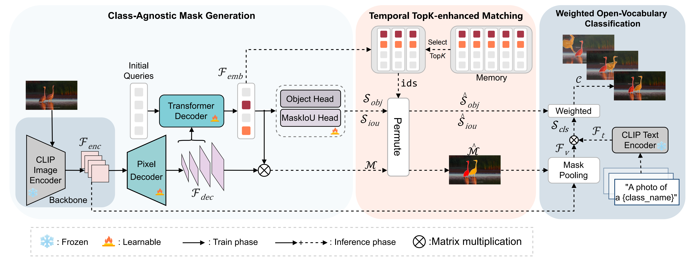

# CLIP-VIS: Adapting CLIP for Open-Vocabulary Video Instance Segmentation

This repo is the official implementation of `CLIP-VIS: Adapting CLIP for Open-Vocabulary Video Instance Segmentation`

:fire: CLIP-VIS is accepted by IEEE TCSVT.

<div style="display: flex;">
    
    
    
    
    
</div>
<div style="display: flex;">
    
    
    
    
    
</div>
<div style="display: flex;">
    
    
</div>
<div style="display: flex;">
    
    
</div>


## Introduction
<br>
- We present a simple encoder-decoder to adapt CLIP
for open-vocabulary video instance segmentation, called
CLIP-VIS. Based on frozen CLIP, our CLIP-VIS retains
strong the zero-shot classification ability to various instance categories.
- We design a temporal topK-enhanced matching strategy,
which adaptively selects K mostly matching frames to
perform query matching.
- We further introduce a weighted open-vocabulary classification module, which refines mask classification by
correlating mask prediction and classification.
- Our CLIP-VIS achieves superior performance on multiple datasets. On the LV-VIS validation set, CLIP-VIS outperforms OV2Seg by 5.3% and 11.1% AP using the ResNet50 and ConNext-B backbones, respectively. Furthermore, when evaluating on novel categories, CLIP-VIS achieves a ignificant improvement, outperforming OV2Seg by 12.3% and 23.9% AP, which demonstrates the robust zero-shot classification ability for unseen categories. Additionally, with ResNet50 as the backbone, CLIP-VIS outperforms OpenVIS by 1.6% AP and 1.4% APn on the BURST dataset validation set, further demonstrating its effectiveness.

For further details, please check out our [paper](https://ieeexplore.ieee.org/document/10706247).
## Installation
Please follow [installation](INSTALL.md). 

## Data Preparation
Please follow [dataset preperation](datasets/README.md).

## Training
We provide shell scripts for training on image datasets and video datasets. ```scripts/train.sh``` trains the model on LVIS or COCO dataset. ```scripts/train_video.sh``` fine-tune the model on YTVIS2019 dataset.

To train or evaluate the model in different environments, modify the given shell script and config files accordingly.

### Training script
```bash
sh scripts/train.sh [CONFIG] [NUM_GPUS] [BATCH_SIZE] [OUTPUT_DIR] [OPTS]
sh scripts/train_video.sh [CONFIG] [NUM_GPUS] [BATCH_SIZE] [OUTPUT_DIR] [OPTS]

# Training on LVIS dataset with ResNet50 backbone
sh scripts/train.sh configs/clipvis_R50.yaml 4 8 output/lvis MODEL.MASK_FORMER.DEC_LAYERS 7
#Training on COCO dataset with ResNet50 backbone
sh scripts/train.sh configs/clipvis_R50.yaml 4 8 output/coco MODEL.MASK_FORMER.DEC_LAYERS 10 DATASETS.TRAIN '("coco_2017_train",)' DATASETS.TEST '("coco_2017_val",)'
#Fine-tune on YTVIS2019 dataset with ResNet50 backbone
sh scripts/train_video.sh configs/clipvis_video_R50.yaml 4 8 output/ytvis MODEL.MASK_FORMER.DEC_LAYERS 10 MODEL.WEIGHTS models/coco/model_final.pth
```

## Evaluation
We provide shell scripts ```scripts/eval_video.sh``` for Evaluation on various video datasets. 
 

### Evaluation script
```bash
sh scripts/eval_video.sh [CONFIG] [NUM_GPUS] [VAL_DATA] [TEST_NUM_CLASS] [OUTPUT_DIR] [WEIGHTS] [OPTS]

#Evaluation on validation set of LV-VIS datset
sh scripts/eval_video.sh configs/clipvis_video_R50.yaml 4 '("lvvis_val",)' 1196 output/lvvis models/clipvis_lvis_r50_7.pth MODEL.MASK_FORMER.DEC_LAYERS 7
```

## Results

We train our network on training set of LVIS dataset and evaluate our network on multiple video datasets. We provide pretrained weights for our models reported in the paper. All of the models were evaluated with 4 NVIDIA 3090 GPUs.


<table><tbody>
<!-- START TABLE -->
<!-- TABLE HEADER -->
<th valign="bottom">Training Data</th>
<th valign="bottom">Backbone</th>
<th valign="bottom">LV-VIS val</th>
<th valign="bottom">LV-VIS test</th>
<th valign="bottom">OVIS</th>
<th valign="bottom">YTVIS19</th>
<th valign="bottom">YTVIS21</th>
<th valign="bottom">BURST</th>
<th valign="bottom">Download</th>
<!-- TABLE BODY -->
<!-- ROW: CLIPVIS (R) -->
<tr>
<td align="center">LVIS</td>
<td align="center">ResNet-50</td>
<td align="center">19.5</td>
<td align="center">14.6</td>
<td align="center">14.1</td>
<td align="center">32.2</td>
<td align="center">30.1</td>
<td align="center">5.2</td>
<td align="center"><a href="https://drive.google.com/file/d/1taVBPVTX-MVQkp5nc0QgreiaJqFhYgtJ/view?usp=drive_link">ckpt</a>&nbsp;
</tr>
<!-- ROW: CLIPVIS (B) -->
<tr>

<td align="center">LVIS</td>
<td align="center">ConvNeXt-B</td>
<td align="center">32.2</td>
<td align="center">25.3</td>
<td align="center">18.5</td>
<td align="center">42.1</td>
<td align="center">37.9</td>
<td align="center">8.3</td>
<td align="center"><a href="https://drive.google.com/file/d/1R7qGowGbY9Al7ygU2fZ-Y5uG5xfgmDyT/view?usp=drive_link">ckpt</a>&nbsp;
</tr>

<tr>
<td align="center">COCO,YTVIS19</td>
<td align="center">ResNet-50</td>
<td align="center">9.4</td>
<td align="center">6.7</td>
<td align="center">15.8</td>
<td align="center">39.7</td>
<td align="center">35.7</td>
<td align="center">4.2</td>
<td align="center"><a href="https://drive.google.com/file/d/14Oed2SbCVZcAtV1yaZIzuc7adGXuHiyZ/view?usp=drive_link">ckpt</a>&nbsp;
</tr>

<tr>
<td align="center">COCO,YTVIS19</td>
<td align="center">ConvNeXt-B</td>
<td align="center">15.9</td>
<td align="center">12.0</td>
<td align="center">18.6</td>
<td align="center">50.0</td>
<td align="center">44.2</td>
<td align="center">5.0</td>
<td align="center"><a href="https://drive.google.com/file/d/1fxujJmjMLAkXubzYSqiv2cVgDYIIp64f/view?usp=drive_link">ckpt</a>&nbsp;
</tr>

</tbody></table>

## Citation

```BibTeX
@article{zhu2024clip,
  author={Zhu, Wenqi and Cao, Jiale and Xie, Jin and Yang, Shuangming and Pang, Yanwei},
  journal={IEEE Transactions on Circuits and Systems for Video Technology}, 
  title={CLIP-VIS: Adapting CLIP for Open-Vocabulary Video Instance Segmentation}, 
  year={2024}
}
```

## Acknowledgement
We would like to acknowledge the contributions of public projects, such as [Mask2Former](https://github.com/facebookresearch/Mask2Former), [LVVIS](https://github.com/haochenheheda/LVVIS/) and [fc-clip](https://github.com/bytedance/fc-clip) whose code has been utilized in this repository.
